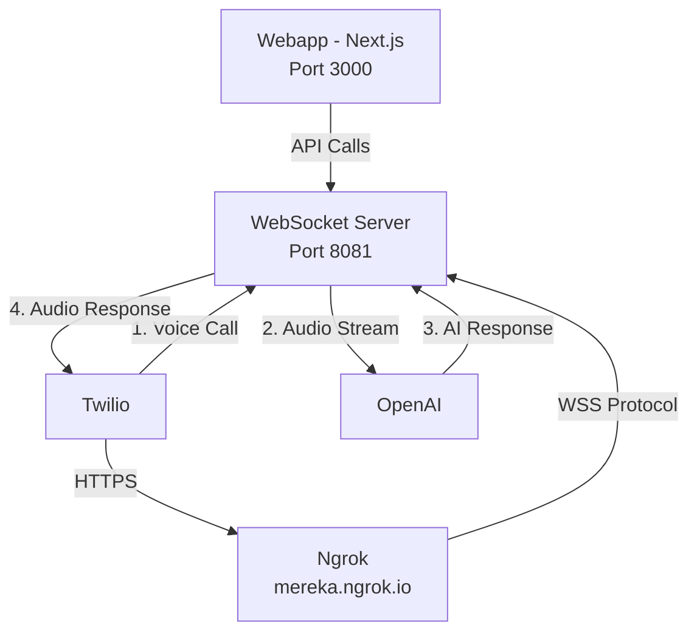

# System Architecture

## Critical Design Decisions and Learnings

### 🎯 Key Architecture Principles

1. **Single Connection Per Call**
   - WHY: Multiple connections cause audio stream conflicts
   - LEARNING: Initially had race conditions with multiple connections
   - SOLUTION: Strict connection management with cleanup

2. **Fixed Ngrok Domain**
   - WHY: Temporary URLs cause webhook instability
   - LEARNING: Random domains broke Twilio callbacks
   - SOLUTION: Using permanent domain 'mereka.ngrok.io'

3. **Separate Environment Files**
   - WHY: Different components need different credentials
   - LEARNING: Mixed credentials caused confusion
   - SOLUTION: Strict separation between webapp and websocket-server

## Component Overview



### 1. Core Components

#### WebSocket Server (Port 8081)
🔑 **Critical Role**: Heart of the system
- Handles WebSocket connections
  ```typescript
  // IMPORTANT: Only one active call at a time
  let currentCall: WebSocket | null = null;
  ```
- Manages audio streams
  ```typescript
  // Must use these exact audio parameters
  format: 'audio/x-mulaw',
  sampleRate: 8000,
  channels: 1
  ```
- Processes Twilio media
  - Strict message validation
  - Proper event sequencing
  - Error recovery
- Communicates with OpenAI
  - Stream processing
  - Response handling
- Serves TwiML responses
  ```xml
  <!-- All parameters are required -->
  <Stream url="wss://mereka.ngrok.io/call">
    <Parameter name="track" value="inbound" />
    <Parameter name="format" value="audio/x-mulaw" />
    <Parameter name="rate" value="8000" />
    <Parameter name="channels" value="1" />
  </Stream>
  ```

⚠️ **Common Pitfalls**:
1. Wrong audio format parameters
2. Multiple active connections
3. Missing track parameters
4. Incorrect WebSocket URL protocol

#### Webapp (Port 3000)
🔑 **Critical Role**: User Interface & Control
- Call initiation
  ```typescript
  // Must use correct phone number format
  from: '+60393880542',  // With country code
  to: '60393880467'      // Local format
  ```
- Status monitoring
  - Real-time connection state
  - Call progress tracking
  - Error reporting
- Configuration management
  - Environment validation
  - Credential handling
- Logging display
  - Connection events
  - Call status
  - Error tracking

⚠️ **Common Pitfalls**:
1. Wrong phone number format
2. Missing environment variables
3. Incorrect API endpoints
4. State management issues

#### Ngrok Tunnel
🔑 **Critical Role**: Public Access Point
- Fixed domain: mereka.ngrok.io
  ```bash
  # MUST use this exact command
  ngrok http --domain=mereka.ngrok.io 8081
  ```
- Routes Twilio traffic
  - HTTPS for API calls
  - WSS for WebSocket
- Handles protocol upgrades
  - HTTP → HTTPS
  - WS → WSS

⚠️ **Common Pitfalls**:
1. Using temporary URLs
2. Wrong port forwarding
3. Missing authentication
4. Protocol mismatch

## Critical Paths

### 1. Call Flow
```sequence
User->Twilio: 1. Dials 60393880467
Twilio->Ngrok: 2. Requests TwiML
Ngrok->WebSocket: 3. Forwards to /twiml
WebSocket->Twilio: 4. TwiML Response
Twilio->WebSocket: 5. WSS Connection
WebSocket->OpenAI: 6. Stream Audio
OpenAI->WebSocket: 7. AI Response
WebSocket->Twilio: 8. Audio Response
```

### 2. Error Points
1. **TwiML Generation** (Step 3-4)
   - Missing parameters
   - Invalid URL format
   - Wrong protocol

2. **WebSocket Connection** (Step 5)
   - Connection refused
   - Protocol mismatch
   - Track ID issues

3. **Audio Streaming** (Step 6-8)
   - Format mismatch
   - Buffer overflow
   - Stream interruption

## Performance Considerations

### 1. Memory Management
```typescript
// Clear buffers after processing
audioBuffers.forEach(buffer => buffer.fill(0));
audioBuffers = [];
```

### 2. Connection Handling
```typescript
// Always cleanup before new connection
if (currentCall) {
  currentCall.removeAllListeners();
  currentCall.close();
}
```

### 3. Resource Limits
- Single active call
- Memory constraints
- Buffer size limits
- Connection timeouts

## Known Limitations

### 1. Infrastructure
- Single WebSocket server
- No load balancing
- Fixed ngrok domain
- Port requirements

### 2. Scalability
- One call at a time
- Memory constraints
- Processing limits
- Bandwidth caps

## Future Improvements

### 1. Immediate Needs
- Better error recovery
- Connection monitoring
- Resource tracking
- Performance metrics

### 2. Long-term Goals
- Multiple call support
- Load balancing
- Automated recovery
- Metrics dashboard

## Environment Configuration

### 1. File Structure
```
/Twilio
├── webapp/
│   ├── .env            # Twilio credentials
│   └── app/
│       └── api/
│           └── call/   # Call handling
├── websocket-server/
│   ├── .env           # OpenAI key & ngrok URL
│   └── src/
│       ├── server.ts  # WebSocket handling
│       └── twiml.xml  # Call configuration
└── start.sh           # Startup orchestration
```

### 2. Environment Variables

#### webapp/.env
```env
TWILIO_ACCOUNT_SID=ACab6a3b51e6078865e1e39e8005dc2bcd
TWILIO_AUTH_TOKEN=eb6c2c6ed99fec1d5190fc95b4815c37
TWILIO_PHONE_NUMBER=60393880467
TWILIO_OUTBOUND_NUMBER=+60393880542
```

#### websocket-server/.env
```env
OPENAI_API_KEY=sk-...
PUBLIC_URL=https://mereka.ngrok.io
```

## Communication Flow

### 1. Outbound Call Process
```sequence
User->Webapp: Initiates call
Webapp->Twilio: POST /api/call
Twilio->WebSocket Server: GET /twiml
WebSocket Server->Twilio: TwiML response
Twilio->WebSocket Server: WSS connection
WebSocket Server->OpenAI: Stream audio
OpenAI->WebSocket Server: AI response
WebSocket Server->Twilio: Audio response
```

### 2. Inbound Call Process
```sequence
User->Twilio: Calls Twilio number
Twilio->WebSocket Server: GET /twiml
WebSocket Server->Twilio: TwiML response
Twilio->WebSocket Server: WSS connection
WebSocket Server->OpenAI: Stream audio
OpenAI->WebSocket Server: AI response
WebSocket Server->Twilio: Audio response
```

## Critical Paths

### 1. WebSocket Connection
- Path: `/call`
- Protocol: WSS
- Domain: mereka.ngrok.io
- Port: 443 (HTTPS)

### 2. TwiML Endpoint
- Path: `/twiml`
- Method: POST/GET
- Content-Type: text/xml
- Required Parameters: None

### 3. Call API
- Path: `/api/call`
- Method: POST
- Content-Type: application/json
- Required Parameters: from, to

## State Management

### 1. Connection States
- Disconnected
- Connecting
- Connected
- Error

### 2. Call States
- Initiated
- Ringing
- In-Progress
- Completed

## Security Considerations

### 1. Credential Management
- Environment variables only
- No hardcoding in code
- Separate .env files
- Git-tracked (project requirement)

### 2. Connection Security
- WSS protocol required
- HTTPS for all endpoints
- Fixed ngrok domain
- No temporary URLs

## Performance Considerations

### 1. Connection Management
- Single active connection per call
- Clean disconnection handling
- Resource cleanup on close
- Memory management

### 2. Audio Processing
- 8kHz sample rate
- Mulaw format
- Single channel
- Minimal latency

## Known Limitations

### 1. Infrastructure
- Single WebSocket server
- No load balancing
- Fixed ngrok domain
- Port requirements

### 2. Scalability
- Single connection per call
- Memory constraints
- Processing limitations
- Bandwidth requirements
